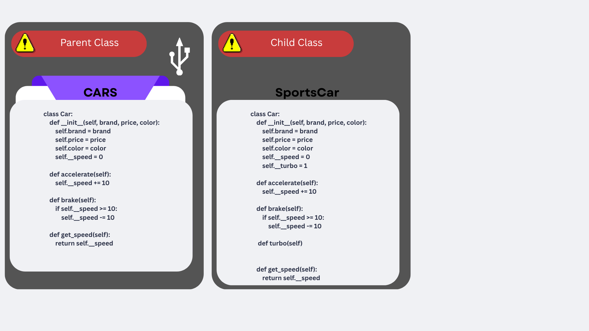
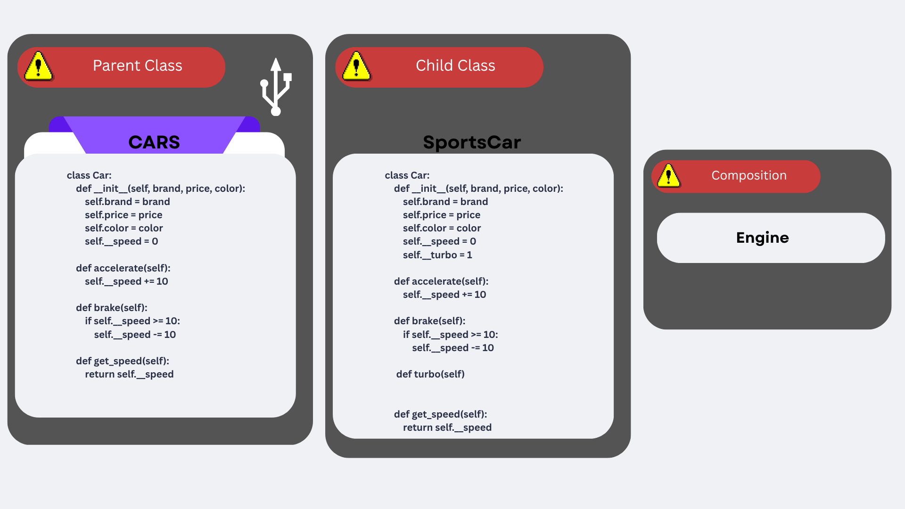
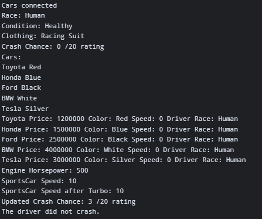

# Advanced Class Relationships
## Previous Activities
[classAttrib](classAttributesMethods.md)
[classRel](classRelationships.md)
## Existing System Description:
The existing system contains my Car and Driver classes. The car contains informations about attributes such as brands, price, color, and speed. The driver class contains the information and how they are associated with their owned cars.
## Inheritance Relationship
#### Parent: Car
#### Child: SportsCar
#### Explanation: SportsCar is a type of a car. It inherits the common attribute and methods of the original parent class, but it may contain additional attributes or methods.
## Inheritance UML

## Composition/Aggregation
Relationship:
Explanation:
## Advanced UML Diagram

## Python Implementation
[Source Code](advancedRelationships.py)
## Test Run

## Object Diagram

## Reflection
Answers:
