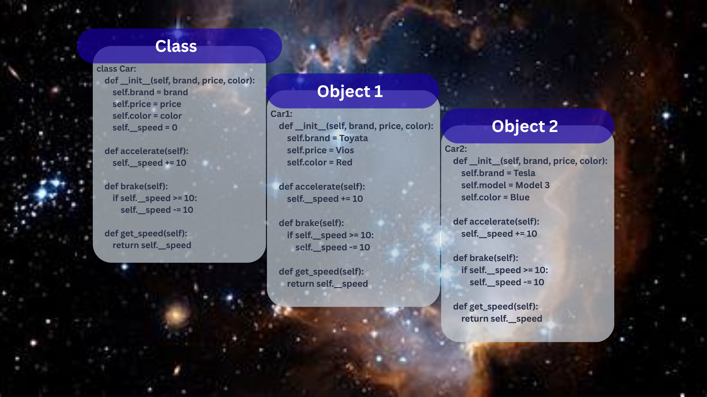

# Class Attributes and Methods
## Previous Design
Link to my previous activity:
[classObjectUML.md](classObjectUML.md)
## Design Revision
Describe any changes made to your original class.
Adding image for class diagram

## Visibility Decisions
| Attribute | Data Type | Visibility | Reason |
|---|---|---|---|
|type |str |public |Describes the type of car and brand. |
|price |float|public |To inform the buyer about the price. |
|color |str |public |The color can be directly scene |
|_speed |int |private |The speed should be controlled by methods instead of directly. |
## Updated UML Class Diagram

## Python Implementation

[View Python Source](classImplementation.py)
## Test Run

## Object Diagram

## Analysis
### Why did you make your chosen attribute private?
I made speed private in order for it not to be directly changed and instead needing methods to control the speed.
### Which method changes the state of your object?
The accelerate() and break() methods change the speed attribute of the vehicle.
### How did your two objects demonstrate that instances are independent?
My objects showed independency by having different types, color, and price. It also showed that changing the speed of one car does not affect the other cars.
### What is the difference between your class diagram and your object diagram?
The class diagram shows the design of the car or the blueprint for the objects. The objects are the actual individual cars.
