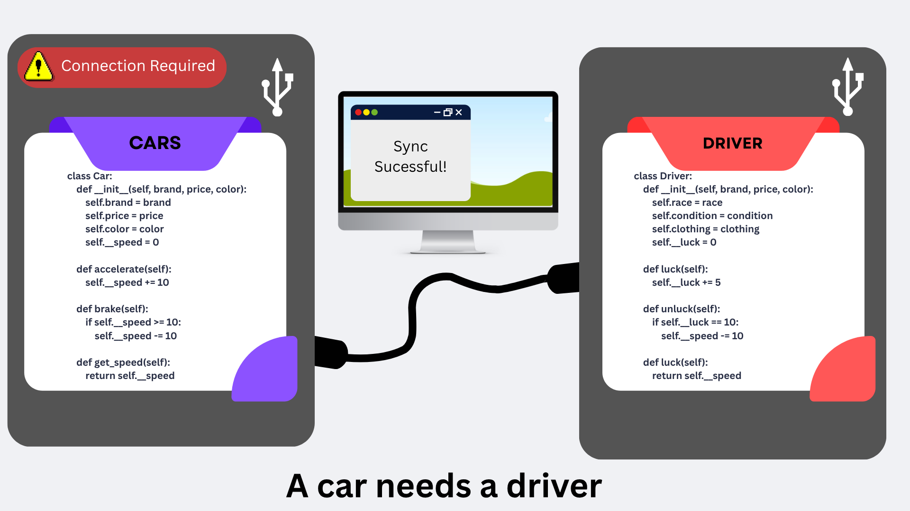
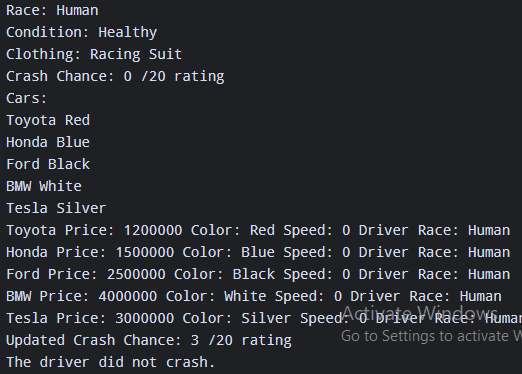

# Class Relationships: Association and Multiplicity 
## Previous Work 
[Part I - Classes and Objects](classObjectUML.md) 
[Part II - Class Attributes and Methods](classAttributesMethods.md) 
## Existing Class 
#### Class: Cars
#### Description: A type of vehicle with different brands.
## New Related Class 
#### Class: Driver
#### Description: The one in control of the car or any vehicle.
## Association 
#### Relationship: A car needs a driver to be used, and a driver needs a car to be able to go to some places.
#### Explanation:  A car needs a driver to be used, and a driver needs a car to be able to go to some places.
## Multiplicity
#### Multiplicity: 
###### Car:
| Minimum and Maximum of Atributes | Description/Label |
|---|---|
| 4 | Wheels of the car |
| 1..* | Chairs |
| * | Bodykits and mods |
| 1 | Engine |
| 0..2 | Turbo |
###### Driver:
| Minimum and Maximum of Atributes | Description/Label |
|---|---|
| 1 | Steering wheel to hold |
| 0..* | Traffic violations |
| * | Cars owned |
| 1 | Current Car Operating |

## Updated UML Class Diagram
#### Explanation: 
## UML Class Relationship Diagram 
 
## Python Implementation 
[View Python Source](classRelationships.py) 
## Test Run 
 
## Object Relationship Diagram 
 
## Analysis 
### What is the association between your two classes? 
### What multiplicity did you choose and why? 
### How did you implement the relationship in Python? 
### Why did you store an object reference instead of copying its data? 
### If your relationship uses many, why is a list appropriate? 
